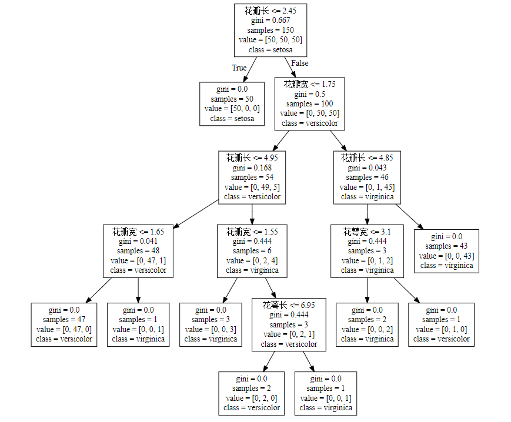

# tree2rule
基于决策树生成可视化规则


做法：

- 前置动作：通过样本训练一个决策树分类器
- 构建做法：读取训练好的决策树模型信息，递归遍历节点构建一个规则树
- 构建过程：构建关系，填充节点属性，递归遍历
- 规则获取：从叶子节点往上找父节点，形成一条路径，每条路径都是一个规则


## Examples:

基于sklearn的iris数据：

```python
import numpy as np
from sklearn.datasets import load_iris
from sklearn import tree
from TreeToRule import *


iris = load_iris()
clf = tree.DecisionTreeClassifier()
clf = clf.fit(iris.data, iris.target)

feature_names=['花萼长','花萼宽','花瓣长','花瓣宽']
class_names=iris.target_names

treeUtil = TreeUtil(
	clf=clf,
	feature_names=feature_names,
	class_names=class_names
)
returndata = treeUtil.getRuleList(top_num=10, print_detail=True)
```


执行效果：

```
满足条件的节点：[1, 5, 16, 8, 10]
规则明细：
|node_id |num |num_pct |class      |rule                                                                       
|1       |50  |0.3333  |setosa     | 花瓣长 <= 2.45                                                               
|5       |47  |0.3133  |versicolor | 花瓣长 > 2.45 and 花瓣宽 <= 1.75 and 花瓣长 <= 4.95 and 花瓣宽 <= 1.65                
|16      |43  |0.2867  |virginica  | 花瓣长 > 2.45 and 花瓣宽 > 1.75 and 花瓣长 > 4.85                                  
|8       |3   |0.02    |virginica  | 花瓣长 > 2.45 and 花瓣宽 <= 1.75 and 花瓣长 > 4.95 and 花瓣宽 <= 1.55                 
|10      |2   |0.0133  |versicolor | 花瓣长 > 2.45 and 花瓣宽 <= 1.75 and 花瓣长 > 4.95 and 花瓣宽 > 1.55 and 花瓣长 <= 5.45  
|15      |2   |0.0133  |virginica  | 花瓣长 > 2.45 and 花瓣宽 > 1.75 and 花瓣长 <= 4.85 and 花萼长 > 5.95                  
|6       |1   |0.0067  |virginica  | 花瓣长 > 2.45 and 花瓣宽 <= 1.75 and 花瓣长 <= 4.95 and 花瓣宽 > 1.65                 
|11      |1   |0.0067  |virginica  | 花瓣长 > 2.45 and 花瓣宽 <= 1.75 and 花瓣长 > 4.95 and 花瓣宽 > 1.55 and 花瓣长 > 5.45   
|14      |1   |0.0067  |versicolor | 花瓣长 > 2.45 and 花瓣宽 > 1.75 and 花瓣长 <= 4.85 and 花萼长 <= 5.95  
```


效果验证：

将决策树通过graphviz进行可视化：

```
from sklearn import tree

dot_data = tree.export_graphviz(
        clf, 
        feature_names=feature_names,
        class_names=class_names,
        out_file=None
    )
dot_data
```


将dot_data内容在graphviz提供的在线可视化网站的展示，以验证是否满足上面生成的规则



